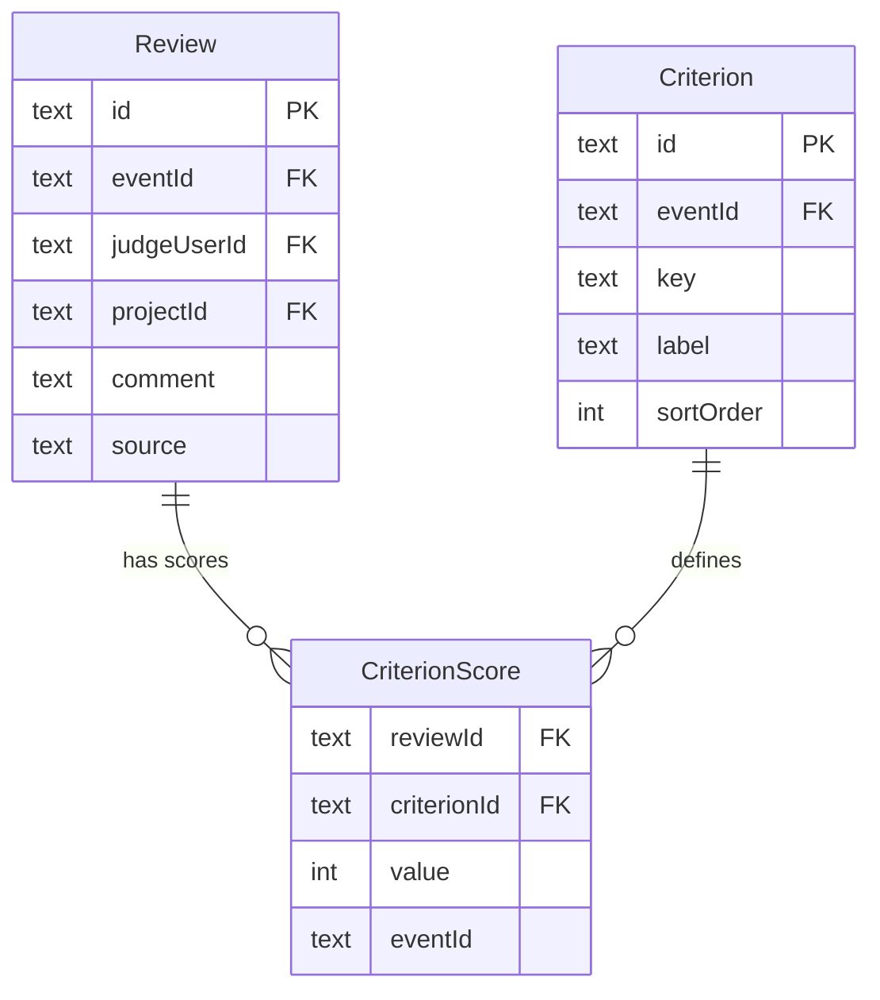
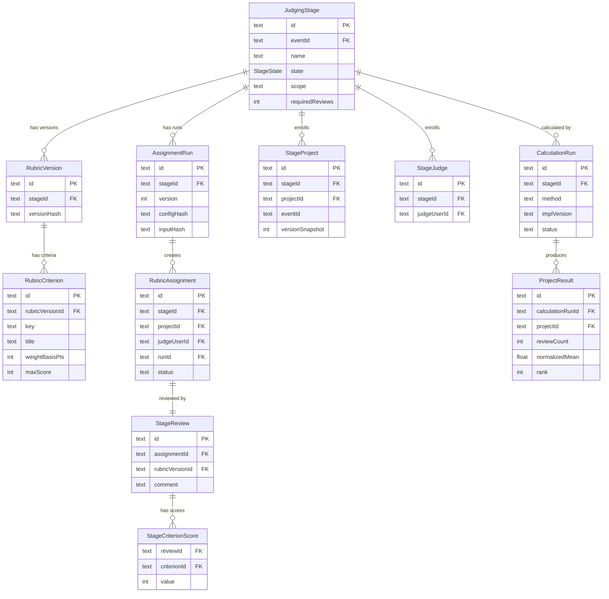
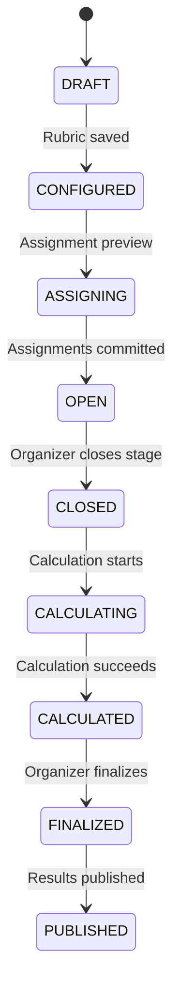

# kryPsis Dogfood — `evt_01` Data & Dashboard Fix Report

## Table of Contents
1. [Problem Summary](#1-problem-summary)
2. [Root Cause Analysis](#2-root-cause-analysis)
3. [Database Architecture: Two Scoring Systems](#3-database-architecture-two-scoring-systems)
4. [Bugs Found & Fixes Applied](#4-bugs-found--fixes-applied)
5. [All Scripts Used](#5-all-scripts-used)
6. [Detailed Database Schemas](#6-detailed-database-schemas)
7. [Files & Functionality Changed](#7-files--functionality-changed)
8. [Remaining Bugs & How to Fix Them](#8-remaining-bugs--how-to-fix-them)

---

## 1. Problem Summary

The event `evt_01` ("Sample Hack 2026") had fixture data seeded via [`scripts/seed.ts`](file:///d:/kryPsis-dogfood/scripts/seed.ts) and [`docs/official/fixtures.json`](file:///d:/kryPsis-dogfood/docs/official/fixtures.json). Three dashboard issues were reported:

| # | Issue | Status |
|---|-------|--------|
| 1 | No organizer user existed for `evt_01` → can't access organizer dashboard | ✅ Fixed |
| 2 | Judges not visible in organizer dashboard | ✅ Fixed |
| 3 | Fixture scores not visible in organizer or judge dashboards | ⚠️ Partially Fixed |

---

## 2. Root Cause Analysis

### Bug 1: No Organizer Access

The seed script creates `evt_01` with `createdById = platform_admin`, but **never creates an `EventRole` with `role = 'ORGANIZER'`** for any user on that event. The organizer dashboard at `/organizer/events/evt_01` checks:

```tsx
// app/organizer/events/[eventId]/page.tsx — line 17-22
const isOrg = await prisma.eventRole.findUnique({
    where: { eventId_userId: { eventId, userId: session.user.id } }
});
if (!isOrg || isOrg.role !== "ORGANIZER") {
    return <div>Access Denied...</div>;
}
```

**No user could pass this check for `evt_01`.**

### Bug 2: Judges Not in Dashboard

The [`JudgesSection.tsx`](file:///d:/kryPsis-dogfood/app/organizer/events/%5BeventId%5D/JudgesSection.tsx) fetches from `/api/events/${eventId}/judge-access`, which queries the `EventJudgeAccess` table — **not** `EventRole`. The seed script creates `EventRole` records with `role = 'JUDGE'` but never creates corresponding `EventJudgeAccess` records for `evt_01`.

### Bug 3: Scores Not Visible

This is the most fundamental issue. The app has **two completely separate scoring systems**:

| System | Tables | Populated for `evt_01`? | Used by dashboards? |
|--------|--------|------------------------|-------------------|
| **Legacy** | `Review`, `CriterionScore`, `Criterion` | ✅ Yes (seed populates these) | ❌ Only in CSV export (`historical_reviews` type) |
| **Stage-based (Modern)** | `JudgingStage`, `RubricAssignment`, `StageReview`, `StageCriterionScore`, `CalculationRun`, `ProjectResult` | ❌ No (seed only creates these for the "demo" event) | ✅ Yes — all dashboards use this |

**The seed script writes scores to legacy tables that no dashboard reads.**

---

## 3. Database Architecture: Two Scoring Systems

### Legacy System (populated by seed for `evt_01`)



### Modern Stage-Based System (what dashboards use)



### Stage State Machine



---

## 4. Bugs Found & Fixes Applied

### Fix 1: Seed Organizer User

**Problem:** No user had `ORGANIZER` role for `evt_01`.

**Fix:** Inserted a new user + `EventRole` + `account` (for login) via raw SQL through `docker exec -i krypsis-dogfood-db-1 psql`.

**Records created:**

| Table | Record |
|-------|--------|
| `user` | `id = 'c_org_12345'`, `name = 'New Organizer'`, `email = 'organizer@example.com'` |
| `EventRole` | `eventId = 'evt_01'`, `userId = 'c_org_12345'`, `role = 'ORGANIZER'` |
| `account` | `providerId = 'credential'`, password hash for `dogfood_local_dev` |

**Login credentials:** `organizer@example.com` / `dogfood_local_dev`

---

### Fix 2: Backfill `EventJudgeAccess` Records

**Problem:** [`JudgesSection.tsx`](file:///d:/kryPsis-dogfood/app/organizer/events/%5BeventId%5D/JudgesSection.tsx) fetches from the [`/api/events/[eventId]/judge-access`](file:///d:/kryPsis-dogfood/app/api/events/%5BeventId%5D/judge-access/route.ts) route, which queries `EventJudgeAccess` — not `EventRole`. Seed only created `EventRole` entries for judges.

**Fix:** Ran [`scratch/seed-judge-access.sql`](file:///d:/kryPsis-dogfood/scratch/seed-judge-access.sql)

**Records created:**
- 30 `EventJudgeAccess` rows (status = `ACTIVE`)
- 39 `EventJudgeAccessTrack` rows (linking judges → tracks)

---

### Fix 3: Migrate Legacy Scores to Modern Stage System

**Problem:** Scores were in `Review`/`CriterionScore` (legacy). Dashboards read from `JudgingStage`/`RubricAssignment`/`StageReview`/`StageCriterionScore` (modern).

**Fix:** Three-phase SQL migration.

#### Phase 3a — Create Stage Infrastructure (via Prisma `upsert` from earlier failed TS run + SQL)

The `JudgingStage` and `RubricVersion`/`RubricCriterion` were created by an early (partially successful) Prisma script run:

| Table | Record |
|-------|--------|
| `JudgingStage` | `id = 'cmus0zwws0000kile8n0i3fkg'`, `name = 'Initial Fixture Round'`, `state = FINALIZED → later set to CLOSED → CALCULATED` |
| `RubricVersion` | `id = 'cmus0zx2n0001kileph6do30i'`, `versionHash = 'fixture_v1'` |
| `RubricCriterion` | 3 records mapped from legacy `Criterion` table (equal weight 3333/3333/3334 basis pts) |

#### Phase 3b — Migrate Reviews ([`scratch/migrate-reviews-sql.sql`](file:///d:/kryPsis-dogfood/scratch/migrate-reviews-sql.sql))

This was the core migration script:

| Table | Count | How |
|-------|-------|-----|
| `AssignmentRun` | 1 | Created with `version=1`, `configHash='migrated'` |
| `StageProject` | 41 | One per distinct `projectId` in legacy `Review` table |
| `StageJudge` | 30 | One per distinct `judgeUserId` in legacy `Review` table |
| `RubricAssignment` | 126 | One per legacy `Review`, id = `'ra_' + review.id`, status = `SUBMITTED` |
| `StageReview` | 126 | One per legacy `Review`, id = `'sr_' + review.id` |
| `StageCriterionScore` | 378 | One per legacy `CriterionScore`, mapped via `Criterion.key → RubricCriterion.key` |

**ID derivation strategy:** Modern record IDs are deterministically derived from legacy IDs using prefixes (`ra_`, `sr_`), enabling idempotent re-runs and easy cross-referencing.

#### Phase 3c — Create Calculation Results ([`scratch/mock-calculation.sql`](file:///d:/kryPsis-dogfood/scratch/mock-calculation.sql))

| Table | Count | How |
|-------|-------|-----|
| `CalculationRun` | 1 | `method='WEIGHTED_WLS'`, `implVersion='v1'`, `status='SUCCESS'` |
| `ProjectResult` | 41 | Ranked by `AVG(StageCriterionScore.value)` DESC, one per project |

Stage state was set to `CALCULATED` after this.

---

## 5. All Scripts Used

### Script 1: `scratch/seed-judge-access.sql`

**Purpose:** Backfill `EventJudgeAccess` and `EventJudgeAccessTrack` for `evt_01` judges.

**Execution:**
```powershell
Get-Content scratch\seed-judge-access.sql | docker exec -i krypsis-dogfood-db-1 psql -U dogfood -d dogfood_db
```

```sql
BEGIN;

INSERT INTO "EventJudgeAccess" (id, "eventId", "emailNormalized", "userId",
    status, "invitedById", "confirmedById", "confirmedAt", "acceptedAt",
    "createdAt", "updatedAt", version)
SELECT
    'eja_' || row_number() OVER (ORDER BY u.email),
    'evt_01', u.email, er."userId", 'ACTIVE', 'c_org_12345', 'c_org_12345',
    NOW(), NOW(), NOW(), NOW(), 1
FROM "EventRole" er
JOIN "user" u ON er."userId" = u.id
WHERE er."eventId" = 'evt_01' AND er.role = 'JUDGE'
ON CONFLICT ("eventId", "emailNormalized") DO NOTHING;

INSERT INTO "EventJudgeAccessTrack" ("accessId", "eventId", "trackId")
SELECT eja.id, 'evt_01', jt."trackId"
FROM "JudgeTrack" jt
JOIN "user" u ON jt."userId" = u.id
JOIN "EventJudgeAccess" eja
    ON eja."emailNormalized" = u.email AND eja."eventId" = 'evt_01'
WHERE jt."eventId" = 'evt_01'
ON CONFLICT DO NOTHING;

COMMIT;
```

---

### Script 2: `scratch/migrate-reviews-sql.sql`

**Purpose:** Migrate 126 legacy `Review`/`CriterionScore` records into the modern stage system.

**Execution:**
```powershell
Get-Content scratch\migrate-reviews-sql.sql | docker exec -i krypsis-dogfood-db-1 psql -U dogfood -d dogfood_db
```

```sql
BEGIN;
DO $$
DECLARE
    v_stage_id text;
    v_rubric_version_id text;
    v_run_id text;
BEGIN
    SELECT id INTO v_stage_id
      FROM "JudgingStage" WHERE "eventId" = 'evt_01'
       AND name = 'Initial Fixture Round' LIMIT 1;
    SELECT id INTO v_rubric_version_id
      FROM "RubricVersion" WHERE "stageId" = v_stage_id
       AND "versionHash" = 'fixture_v1' LIMIT 1;
    v_run_id := gen_random_uuid()::text;

    -- AssignmentRun (required FK for RubricAssignment.runId)
    INSERT INTO "AssignmentRun" (id, "stageId", "version", "configHash", "inputHash")
    VALUES (v_run_id, v_stage_id, 1, 'migrated', 'migrated');

    -- StageProject enrollment
    INSERT INTO "StageProject" (id, "stageId", "projectId", "eventId", "versionSnapshot")
    SELECT gen_random_uuid()::text, v_stage_id, "projectId", 'evt_01', 1
    FROM (SELECT DISTINCT "projectId" FROM "Review"
          WHERE "eventId" = 'evt_01') r
    ON CONFLICT DO NOTHING;

    -- StageJudge enrollment
    INSERT INTO "StageJudge" (id, "stageId", "judgeUserId")
    SELECT gen_random_uuid()::text, v_stage_id, "judgeUserId"
    FROM (SELECT DISTINCT "judgeUserId" FROM "Review"
          WHERE "eventId" = 'evt_01') j
    ON CONFLICT DO NOTHING;

    -- RubricAssignment (1:1 with legacy Review)
    INSERT INTO "RubricAssignment"
        (id, "stageId", "projectId", "judgeUserId", "runId", status)
    SELECT 'ra_' || id, v_stage_id, "projectId", "judgeUserId",
           v_run_id, 'SUBMITTED'
    FROM "Review" WHERE "eventId" = 'evt_01'
    ON CONFLICT DO NOTHING;

    -- StageReview (1:1 with RubricAssignment)
    INSERT INTO "StageReview"
        (id, "assignmentId", "rubricVersionId", comment)
    SELECT 'sr_' || id, 'ra_' || id, v_rubric_version_id, comment
    FROM "Review" WHERE "eventId" = 'evt_01'
    ON CONFLICT DO NOTHING;

    -- StageCriterionScore (mapped via Criterion.key → RubricCriterion.key)
    INSERT INTO "StageCriterionScore" ("reviewId", "criterionId", value)
    SELECT 'sr_' || cs."reviewId", rc.id, cs.value
    FROM "CriterionScore" cs
    JOIN "Review" r ON cs."reviewId" = r.id
    JOIN "Criterion" c ON cs."criterionId" = c.id
    JOIN "RubricCriterion" rc
        ON rc."rubricVersionId" = v_rubric_version_id AND rc.key = c.key
    WHERE r."eventId" = 'evt_01'
    ON CONFLICT DO NOTHING;
END $$;
COMMIT;
```

---

### Script 3: `scratch/mock-calculation.sql`

**Purpose:** Create a `CalculationRun` with `ProjectResult` rankings so the results page has data.

**Execution:**
```powershell
Get-Content scratch\mock-calculation.sql | docker exec -i krypsis-dogfood-db-1 psql -U dogfood -d dogfood_db
```

```sql
BEGIN;
DO $$
DECLARE
    v_stage_id text;
    v_run_id text;
    v_proj record;
    v_rank integer := 1;
BEGIN
    SELECT id INTO v_stage_id
      FROM "JudgingStage" WHERE "eventId" = 'evt_01'
       AND name = 'Initial Fixture Round' LIMIT 1;
    v_run_id := gen_random_uuid()::text;

    INSERT INTO "CalculationRun"
        (id, "stageId", method, "implVersion",
         "configHash", "inputHash", status, "finishedAt", diagnostics)
    VALUES (v_run_id, v_stage_id, 'WEIGHTED_WLS', 'v1',
            'migrated', 'migrated', 'SUCCESS', NOW(),
            '{"projectsCount": 20, "judgesCount": 30}'::jsonb);

    FOR v_proj IN
        SELECT sp."projectId",
               COALESCE(AVG(scs.value), 0) as avg_score,
               COUNT(DISTINCT ra.id) as review_count
        FROM "StageProject" sp
        LEFT JOIN "RubricAssignment" ra
            ON ra."projectId" = sp."projectId"
           AND ra."stageId" = v_stage_id
        LEFT JOIN "StageReview" sr ON sr."assignmentId" = ra.id
        LEFT JOIN "StageCriterionScore" scs ON scs."reviewId" = sr.id
        WHERE sp."stageId" = v_stage_id
        GROUP BY sp."projectId"
        ORDER BY COALESCE(AVG(scs.value), 0) DESC
    LOOP
        INSERT INTO "ProjectResult"
            (id, "calculationRunId", "projectId", "reviewCount",
             "rawMean", "normalizedMean", "displayedMean", rank)
        VALUES (gen_random_uuid()::text, v_run_id,
                v_proj."projectId", v_proj.review_count,
                v_proj.avg_score, v_proj.avg_score,
                v_proj.avg_score, v_rank);
        v_rank := v_rank + 1;
    END LOOP;

    UPDATE "JudgingStage" SET state = 'CALCULATED'
     WHERE id = v_stage_id;
END $$;
COMMIT;
```

---

## 6. Detailed Database Schemas

### Tables we inserted into (actual `\d` output from PostgreSQL)

#### `EventJudgeAccess`
| Column | Type | Nullable |
|--------|------|----------|
| id | text | NOT NULL |
| eventId | text | NOT NULL |
| emailNormalized | text | NOT NULL |
| userId | text | nullable |
| status | text | NOT NULL (`INVITED`/`AWAITING_CONFIRMATION`/`ACTIVE`/`REVOKED`/`EXPIRED`) |
| invitedById | text | NOT NULL |
| confirmedById | text | nullable |
| version | integer | NOT NULL |
| **Unique** | `(eventId, emailNormalized)` | |

#### `JudgingStage`
| Column | Type | Nullable | Default |
|--------|------|----------|---------|
| id | text | NOT NULL | (cuid) |
| eventId | text | NOT NULL | |
| name | text | NOT NULL | |
| state | StageState | NOT NULL | `'DRAFT'` |
| method | text | NOT NULL | `'RUBRIC'` |
| scope | StageScope | NOT NULL | `'EVENT'` |
| scopeKey | text | NOT NULL | |
| requiredReviews | integer | NOT NULL | `1` |
| **Unique** | `(eventId, name)` | | |

#### `RubricAssignment`
| Column | Type | Nullable |
|--------|------|----------|
| id | text | NOT NULL |
| stageId | text | NOT NULL |
| projectId | text | NOT NULL |
| judgeUserId | text | NOT NULL |
| runId | text | NOT NULL |
| status | text | NOT NULL (`PENDING`/`SUBMITTED`/`CANCELLED`) |
| **Unique** | `(stageId, projectId, judgeUserId)` | |

> [!IMPORTANT]
> `RubricAssignment` does **NOT** have `eventId` or `rubricVersionId` columns. `eventId` is derived through `stageId → JudgingStage.eventId`.

#### `StageReview`
| Column | Type | Nullable |
|--------|------|----------|
| id | text | NOT NULL |
| assignmentId | text | NOT NULL |
| rubricVersionId | text | NOT NULL |
| comment | text | nullable |
| submittedAt | timestamptz | NOT NULL (default `CURRENT_TIMESTAMP`) |
| **Unique** | `(assignmentId)` — 1:1 with RubricAssignment | |

> [!IMPORTANT]
> `StageReview` does **NOT** have `eventId`, `judgeUserId`, `projectId`, or `source` columns. The Prisma schema may define computed relations, but the actual DB columns don't include them.

#### `StageCriterionScore`
| Column | Type | Nullable |
|--------|------|----------|
| reviewId | text | NOT NULL |
| criterionId | text | NOT NULL |
| value | integer | NOT NULL |
| **PK** | `(reviewId, criterionId)` — composite, no `id` column | |

#### `AssignmentRun`
| Column | Type | Nullable |
|--------|------|----------|
| id | text | NOT NULL |
| stageId | text | NOT NULL |
| version | integer | NOT NULL |
| configHash | text | NOT NULL |
| inputHash | text | NOT NULL |
| **Unique** | `(stageId, version)` | |

#### `CalculationRun`
| Column | Type | Nullable |
|--------|------|----------|
| id | text | NOT NULL |
| stageId | text | NOT NULL |
| method | text | NOT NULL |
| implVersion | text | NOT NULL |
| configHash | text | NOT NULL |
| inputHash | text | NOT NULL |
| status | text | NOT NULL (default `PENDING`) |
| diagnostics | jsonb | nullable |

#### `ProjectResult`
| Column | Type | Nullable |
|--------|------|----------|
| id | text | NOT NULL |
| calculationRunId | text | NOT NULL |
| projectId | text | NOT NULL |
| reviewCount | integer | NOT NULL |
| rawMean | double | NOT NULL |
| normalizedMean | double | NOT NULL |
| displayedMean | double | NOT NULL |
| rank | integer | nullable |
| **Unique** | `(calculationRunId, projectId)` | |

---

## 7. Files & Functionality Changed

> [!NOTE]
> **No application source code was modified.** All fixes were data-layer patches via SQL scripts. The app code was only read for diagnosis.

### Files read for diagnosis

| File | Why |
|------|-----|
| [`scripts/seed.ts`](file:///d:/kryPsis-dogfood/scripts/seed.ts) | Understand what the seed creates — discovered it only writes legacy tables for `evt_01` |
| [`app/organizer/events/[eventId]/page.tsx`](file:///d:/kryPsis-dogfood/app/organizer/events/%5BeventId%5D/page.tsx) | Auth check logic + how `stages` prop is loaded |
| [`app/organizer/events/[eventId]/JudgesSection.tsx`](file:///d:/kryPsis-dogfood/app/organizer/events/%5BeventId%5D/JudgesSection.tsx) | Discovered it queries `EventJudgeAccess`, not `EventRole` |
| [`app/organizer/events/[eventId]/JudgingStagesSection.tsx`](file:///d:/kryPsis-dogfood/app/organizer/events/%5BeventId%5D/JudgingStagesSection.tsx) | Discovered state-based visibility conditions for links |
| [`app/organizer/events/[eventId]/judging-actions.ts`](file:///d:/kryPsis-dogfood/app/organizer/events/%5BeventId%5D/judging-actions.ts) | Server actions for stage lifecycle |
| [`app/organizer/events/[eventId]/results/[stageId]/page.tsx`](file:///d:/kryPsis-dogfood/app/organizer/events/%5BeventId%5D/results/%5BstageId%5D/page.tsx) | Results/explainability page — calls `getCalculationPreviewAction` |
| [`app/organizer/events/[eventId]/exports/route.ts`](file:///d:/kryPsis-dogfood/app/organizer/events/%5BeventId%5D/exports/route.ts) | CSV export reads from stage tables |
| [`app/api/events/[eventId]/judge-access/route.ts`](file:///d:/kryPsis-dogfood/app/api/events/%5BeventId%5D/judge-access/route.ts) | GET returns `EventJudgeAccess` |
| [`lib/auth.ts`](file:///d:/kryPsis-dogfood/lib/auth.ts) | Better Auth config |
| [`lib/judging/calculation.ts`](file:///d:/kryPsis-dogfood/lib/judging/calculation.ts) | Weighted WLS algorithm, `generateCalculationPreview`, `commitCalculationRun` |
| [`prisma/schema.prisma`](file:///d:/kryPsis-dogfood/prisma/schema.prisma) | Full data model |

---

## 8. Remaining Bugs & How to Fix Them

### Bug A: `CALCULATED` state missing from "Explainability & Results" link condition

**File:** [`JudgingStagesSection.tsx` line 199](file:///d:/kryPsis-dogfood/app/organizer/events/%5BeventId%5D/JudgingStagesSection.tsx#L199)

**Current code:**
```tsx
{["CLOSED", "CALCULATING", "FINALIZED", "PUBLISHED"].includes(stage.state) && (
    <Link href={`/organizer/events/${eventId}/results/${stage.id}`}>
        Explainability & Results
    </Link>
)}
```

**Problem:** `CALCULATED` is not in the array. Our stage is `CALCULATED`. The link doesn't render.

**Fix:**
```tsx
{["CLOSED", "CALCULATING", "CALCULATED", "FINALIZED", "PUBLISHED"].includes(stage.state) && (
```

> [!WARNING]
> This is an **application code bug**, not a data issue. It affects all events, not just `evt_01`.

---

### Bug B: Mock `CalculationRun` uses simple `AVG()` instead of the real Weighted WLS algorithm

**Problem:** Our [`mock-calculation.sql`](file:///d:/kryPsis-dogfood/scratch/mock-calculation.sql) computed `ProjectResult.normalizedMean` as a simple average of raw scores. The real [`calculateWeightedWLS()`](file:///d:/kryPsis-dogfood/lib/judging/calculation.ts#L4) function performs judge calibration, connectivity checks, and weighted least squares normalization. The mock results won't match what the app's "Recalculate" button would produce.

**Fix:** Either:
1. Transition the stage to `CLOSED` and use the UI's "Calculate" button on the results page to run the real algorithm, or
2. Write a script that calls `generateCalculationPreview()` + `commitCalculationRun()` from [`lib/judging/calculation.ts`](file:///d:/kryPsis-dogfood/lib/judging/calculation.ts) inside the Docker container (requires the source code to be present in the container, which it isn't in the production build).

**Recommended approach:** Set the stage back to `CLOSED`, then use the organizer UI:

```sql
-- Reset to let the UI recalculate properly
DELETE FROM "ProjectResult" WHERE "calculationRunId" IN (
    SELECT id FROM "CalculationRun" WHERE "stageId" = 'cmus0zwws0000kile8n0i3fkg'
);
DELETE FROM "CalculationRun" WHERE "stageId" = 'cmus0zwws0000kile8n0i3fkg';
UPDATE "JudgingStage" SET state = 'CLOSED'
 WHERE id = 'cmus0zwws0000kile8n0i3fkg';
```

Then navigate to `/organizer/events/evt_01/results/cmus0zwws0000kile8n0i3fkg` and click "Calculate" → "Commit".

---

### Bug C: `FinalizationSnapshot` not created → "Finalize" will fail with stale hash

**Problem:** We set state to `CALCULATED` but never created a `FinalizationSnapshot`. The [`finalizeCalculation()`](file:///d:/kryPsis-dogfood/app/organizer/events/%5BeventId%5D/judging-actions.ts#L226-L292) action re-generates a preview and compares `inputHash`/`configHash` against the stored `CalculationRun`. Since we used `'migrated'` as both hashes, a real preview would produce different hashes → **stale finalization error**.

**Fix:** Same as Bug B — use the UI to recalculate from `CLOSED` state.

---

### Bug D: Seed script should be updated to populate modern tables

**Problem:** The root cause of everything is that [`scripts/seed.ts`](file:///d:/kryPsis-dogfood/scripts/seed.ts) writes to legacy tables for `evt_01` but modern tables for the demo event. Future developers will hit the same issue.

**Fix:** Update `seed.ts` to also create stage-based records for `evt_01`, similar to how it does for the demo event (lines 247-314). Specifically:
1. Create `JudgingStage` for `evt_01` (currently only done for demo)
2. Create `EventJudgeAccess` records (currently only `EventRole` is created)
3. Create `RubricVersion` + `RubricCriterion` from fixture criteria
4. Create `AssignmentRun`, `RubricAssignment`, `StageReview`, `StageCriterionScore` from fixture scores
5. Create an `EventRole` with `role = 'ORGANIZER'` for at least one user

---

### Bug E: Docker container doesn't mount source code → can't run ad-hoc scripts

**Problem:** The Docker image is a **production build** (`.next/standalone`). Source files like `lib/`, `app/`, `components/` don't exist inside the container. This means:
- `npx tsx scripts/calc.ts` fails when importing `@/lib/judging/calculation`
- Only pre-existing scripts (like `seed.ts` which is in the build context) can run
- All ad-hoc fixes must use raw SQL via `psql`

**Fix:** Add a volume mount for `scripts/` in [`docker-compose.yml`](file:///d:/kryPsis-dogfood/docker-compose.yml) or [`docker-compose.dev.yml`](file:///d:/kryPsis-dogfood/docker-compose.dev.yml):
```yaml
volumes:
  - ./scripts:/app/scripts
  - ./lib:/app/lib  # if scripts need to import app internals
```

---

### Bug F: `page.tsx` auth doesn't check `isPlatformAdmin`

**Problem:** [`page.tsx` line 21](file:///d:/kryPsis-dogfood/app/organizer/events/%5BeventId%5D/page.tsx#L21) only checks `EventRole`:

```tsx
if (!isOrg || isOrg.role !== "ORGANIZER") {
    return <div>Access Denied...</div>;
}
```

But the **API routes** (e.g., [`judge-access/route.ts`](file:///d:/kryPsis-dogfood/app/api/events/%5BeventId%5D/judge-access/route.ts)) and **server actions** ([`judging-actions.ts` line 16-17](file:///d:/kryPsis-dogfood/app/organizer/events/%5BeventId%5D/judging-actions.ts#L16-L17)) also check `isPlatformAdmin`:

```tsx
if (!role && !adminUser?.isPlatformAdmin) throw new Error("Forbidden");
```

**Impact:** A platform admin can call the APIs but can't see the page. The auth check is inconsistent.

**Fix:**
```tsx
const adminUser = await prisma.user.findUnique({ where: { id: session.user.id } });
if ((!isOrg || isOrg.role !== "ORGANIZER") && !adminUser?.isPlatformAdmin) {
    return <div>Access Denied...</div>;
}
```

---

### Summary: Priority Order for Remaining Fixes

| Priority | Bug | Type | Effort |
|----------|-----|------|--------|
| 🔴 High | **A**: Add `CALCULATED` to results link condition | Code fix (1 line) | 2 min |
| 🔴 High | **D**: Update `seed.ts` for modern tables | Code fix | 1-2 hrs |
| 🟡 Medium | **B/C**: Recalculate with real WLS algorithm | SQL + UI action | 10 min |
| 🟡 Medium | **F**: Auth inconsistency in `page.tsx` | Code fix (3 lines) | 5 min |
| 🟢 Low | **E**: Mount source in Docker for dev | Config fix | 5 min |
